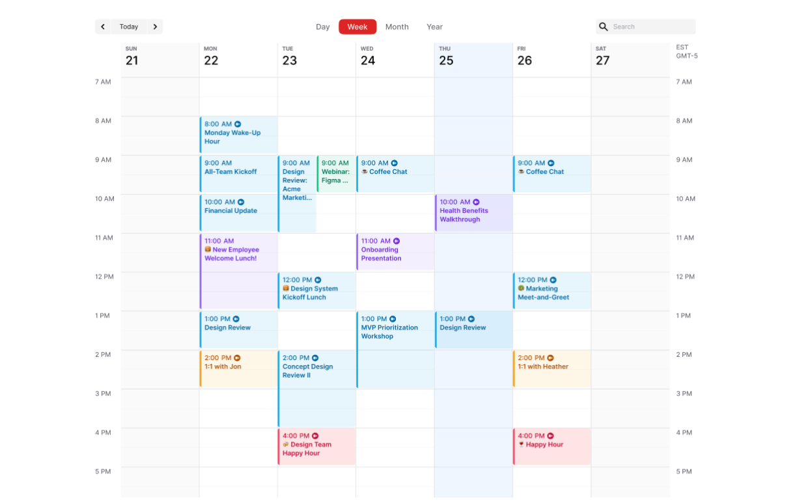

Build a calendar using React JS with mongoDB, Redux

Figure A
• Create a calendar with the week view(check the two images below)
• It should work similar to google calendar
• Events are the tiles or boxes that you see on the calendar eg: “Monday Wake-up”,
“All-Team Kickoff”, etc
• To create an event, auser clicks on the calendar, the modal/dialog box open up( as
Figure B). User enter information as shown.
o Title: title of event
o Category: drop down consisting of 6 options: exercise, eating, work, relax,
family and social
o Date, start and end time
o Thinks don’t have to be the same as long as the functionality is implemented
• The user can move the events across the calendar. Eg: I can move the event event
“Coffee chat” wed from 9 am to Thr 9am by drag and drop.
• All the state management should be done using redux
• All the events data needs to be stored in MongoDB or any prefered database
• APIs should have POST, GET and PUT capabilities
• Please ask me any questions you have
• You will be asked in depth questions of the project during the next round interview
• You have 2 days to submit the assignment.

Figure B